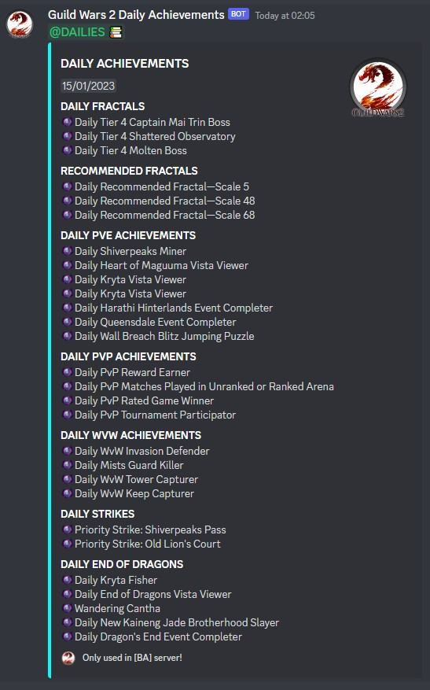
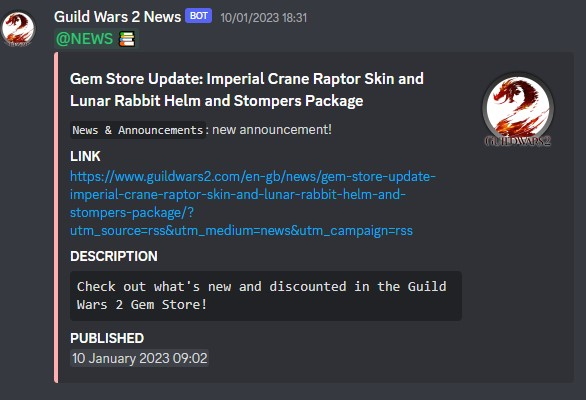
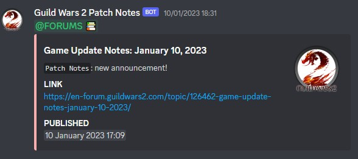
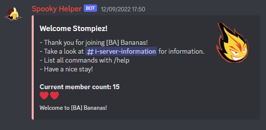
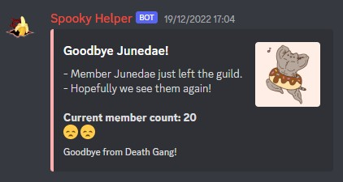

# GW2 Discord Bot
- Discord Bot made specifically for GW2 {[Guild Wars 2](https://www.guildwars2.com/en-gb/)}.
- Brief overview: GW2 is an MMORPG game that bases around free open-world gameplay, along with high-end gameplay.
- It has three main gamemodes: PvE, PvP and WvW. 
- This bot tries to help the users of my Discord Server by providing useful PvE information.

## Table of contents
- [New features](https://github.com/NenadGvozdenac/GW2_DiscordBot#constantly-be-updated-about-new-features)
- [ArcDPS Logging](https://github.com/NenadGvozdenac/GW2_DiscordBot#arcdps-log-uploading)
- [Multiple ArcDPS logging](https://github.com/NenadGvozdenac/GW2_DiscordBot#parsing-multiple-arcdps-logs-in-an-embed)
- [Account information](https://github.com/NenadGvozdenac/GW2_DiscordBot#account-information)
- [Static managemenet](https://github.com/NenadGvozdenac/GW2_DiscordBot#group-static-management)
- [Weekly raids & real-time logging](https://github.com/NenadGvozdenac/GW2_DiscordBot#weekly-raids--real-time-logging)
- [All rounder moderation tool](https://github.com/NenadGvozdenac/GW2_DiscordBot#all-rounder-moderation-tool)
- [Welcome & Leave messages](https://github.com/NenadGvozdenac/GW2_DiscordBot#welcome--leave-messages)

# Constantly be updated about new features
This bot comes with many features as an all-rounder for all information PvE related for Guild Wars 2.
It tries to help the users by providing useful information regarding raiding, high-end PvE content, etc.
News, Patch Notes & Logging are all made on separated webhooks, therefore using different threads, maximising performance.
## Daily Achievements
This bot has the ability to automatically send updates when new achievements drop daily.
It will send achievements to the discord server.

## News & Updates
This bot has the ability to automatically send updates when news & patch notes drop.

# ArcDPS log uploading
Log uploading has never been easier! Simply dragging a `.zevtc`. file in any channel the bot is present in, will upload the log, and give you a small summary.
It utilises the DPS.REPORT api POST method for posting logs, and by returning some information about the log, the bot is able to give you some information about it and also provide a link.
The user has the ability to look up previous logs in the discord channel that he/she had been previously tagged in.
It connects automatically to [dps.report API](https://dps.report/api).
DPS summary is saved in the graph in the Embed.

## Parsing multiple ArcDPS logs in an Embed
Getting a nice bit of information has never been easier. By sending a batch of logs in the bot's DMs or in the discord server, you are given a nice embed back as response!

# Account Information
This bot, connecting to GW2 api, has the ability to send you information about your account.
This information can vary from what you wish to seek: account / character info / daily fractal info, etc.
By using `/gw2account`, your account stats are shown to you.
By using `/gw2character`, your character's stats are shown to you. You also have the ability to select which character you wish to see stats of.
Added API keys are stored in a json file that is secretly saved.

# Group (static) management
Leading a group has been very simplified by commands that are easy to understand, and easy to use.
Commands listed below are used for signing up and subscribing for the static (weekly) raid.
All data is stored in a `.xlsx`. file, where it can be easily read from the server.

| Command               | Permissions   | Description                                               |
| --------------------- | ------------- | --------------------------------------------------------- |
| /signup               | All Users     | Signs you up for the raid.                                |
| /unsignup             | All Users     | Unsigns you from the raid (if you are already signed up). |
| /signupcheck          | All Users     | Check your signup status.                                 |
| /signupform           | All Users     | Sends you the form for signing up.                        |
| /signupcheckmyloadout | All Users     | Sends you your loadout for the raid.                      |
| /signupplayer         | Administrator | Forcefully signs up a player.                             |
| /signupdelete         | Administrator | Deletes a signup by force.                                |
| /signupclear          | Administrator | Deletes all signups.

Some other commands exist purely for ease-of-life for leading purposes. Backups and full-static roles, alongside Applicant roles can be added using `/staticaddbackup`, `/staticaddplayer`, `/staticaddapplicant`. 
All commands have a way to stop the process, and a `HELP` button which gives you information what the command is used for.

# Weekly Raids & Real-Time Logging
Every week, one hour before the raid, a countdown can be activated manually by doing `/startstaticraid <time>`. 15m < time < 60m. 
15 minutes before the raid, everyone that is subscribed to the raid is pinged. 
In the beginning of the raid, a server is activated for receiving logs. A special port is open for receiving logs. 
In combination with [Autouploader](https://github.com/NenadGvozdenac/AutoLogUploader), you can auto upload logs whenever the encounter is finished. 

# All-Rounder moderation tool
The Discord bot is overall very useful for its moderation capabilities, useful for its commands and overall discord logging.

| Command  | Description                                          |
| -------- | ---------------------------------------------------- |
| /kick    | Kicks the member out of the server.                  |
| /ban     | Bans the member from the server.                     |
| /mute    | Mutes the member in the server for x amount of time. |
| /timeout | Timeouts the user for some time.                     |

# Welcome & Leave messages
On member join and leave events, a special message is sent in `#welcome` & `#goodbye`. 

 
<!--

# Newest update: v3.3.0
Added new static commands and linked them to discord members.
Now, there is another sheet that just has members and their original roles.
Static members are there by default when they join, and if for some reason we remove them, there is a command for that.

# Newest update: v3.2.0
Fixed daily achievements sometimes not being sent, by utilising asynchronous functions.
Added buttons to `/signup` and `/signupplayer` messages. 
`Cancel` button cancels the action, editing the message, and removing the ActionRows.
`Help` button removes the ActionRows, and sends the message explaining the command to the user.
Formatted the dps.reports logging, now indicating the group's dps.

# Update: v3.0.0
Separated commands into three files: `StaticSlashCommandInteraction.java`, `SlashCommandInteraction.java` & `Gw2SlashCommandInteraction.java`
Added new commands to help with static needs:
`/signupsheet`, admin command that returns the data storage for all static needs
`/signupcheckmyloadout`, public command that returns the loadout required by the player for that static raid
Made all static commands not doable in DM with the bot. It just felt weird.
`/startstaticraid`, admin command that starts the raid, now pings everyone at the start. It also lists everyone's roles below the ping.
`/startstaticraid`, also now takes an input of minutes. After minutes have passed, everyone will be pinged. It opens the port on the server for logs to flow into. After 4 hours, if the port is still open, it closes the port. (Administrator probably forgot to close it manually)
`/stopstaticraid`, only stops the server.

# Update: v2.1.0
Added an AUTOUPLOADER that works on the basis of Client-Server.
On the hosting server, there exists a possibility to have a server. A server is hosted on a certain port.
The server can be created by doing `/startstaticraid`, which makes the server active.
Upon doing `/stopstaticraid`, the server deactivates.
This server is one of the features for automatic uploading logs.
A client application (also made), sends the log to the server via a link.
Server responds if they got the file, and if the return is **200**, log is uploaded to a discord text channel.

- Added static commands that will be used for the static group I am leader of!
`/signup`, signs the person up for a certain role on that week.
`/unsignup`, unsigns the person from this week's raids.
`/signupform`, gives the person the form for the signups.

`/signupcheck`, admin command that lets the admins see the list of people signed up and their roles.
`/signupdelete`, admin command that lets the admins delete a signup forcefully.
`/signupplayer`, admin command that lets the admins sign up a person forcefully.
`/signupclear`, admin command that lets the admins clear all signups for that week.

A sheet is stored in the database of the server. All data is saved there, if need comes that it should be retrieved.

`/qtpfires`, gives the picture of the qadim the peerless fires that are optimal.

News, Patch Notes & Logging are all made on separated webhooks, therefore using different threads, maximising performance.

### Daily achievements
This bot has the ability to automatically send updates when new achievements drop daily.
It will send achievements to the discord server.

### Welcome & Leave messages
Bot is able to send welcome and leave messages whenever a user joins/leaves the guild the bot is in.
It also keeps track of current users. -->
